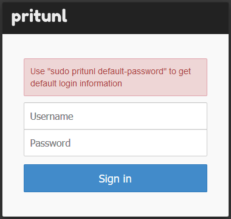

## 測試環境: Ubuntu 18.04 Server x64 on ESXI

Install Docker on Ubuntu:
<br>
[Document Link](https://docs.docker.com/install/linux/docker-ce/ubuntu/)
<br><br>
Install pip3:
```
curl https://bootstrap.pypa.io/get-pip.py | python3
```
<br><br>
Install docker-compose:
```
pip3 install docker-compose
```
<br><br>
Pull docker image:
```
docker pull yojo3000/pritunl
```
<br><br>
Or build the image yourself:
```
docker build . -t whatever/name_youwant
```
<br><br>
Turn on docker-compose from this repo:
```
docker-compose up
```
<br><br>
Visit Pritunl from browser:
```
https://ip_address
```
You will see that page below:
<br><br>

<br><br>
Enter docker container by container_name (pritunl):
```
docker exec -it pritunl /bin/bash
```
<br><br>
Get pritunl setup key. Copy the key and paste that in browser:
```
pritunl setup-key
```
<br><br>
Don't forget to modify mongodb_uri from localhost to mongodb (hostname of mongodb container)
<br><br>
If pritunl and mongodb work properly, you will see that page below:
<br><br>

<br><br>
Enter docker container"
```
docker exec -it pritunl /bin/bash
```
<br><br>
Get Pritunl default password for login
```
pritunl default-password
```
